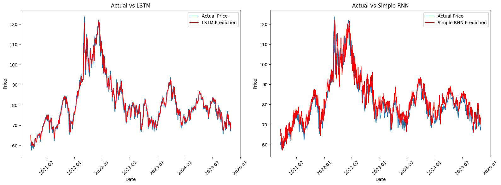

<h1 align="center">
  Oil Price Prediction Using LSTM & Simple RNN
</h1>

  

  <b>Deep Learning Time-Series Forecasting Project</b> 
  Developed during my internship at <b>Aramco</b>

## Project Overview

This project focuses on predicting oil prices using deep learning models for time-series forecasting.  
The main goal is to compare the performance of **LSTM** and **Simple RNN** in forecasting future oil closing prices.

---

## Dataset

| Item | Description |
|---|---|
| Source | Kaggle |
| Type | Open-source historical oil price dataset |
| Target Column | Close Price |
| Task | Time-Series Forecasting |

---

## Models Used

| Model | Description | Strength |
|---|---|---|
| LSTM | Learns long-term patterns using memory gates | Better for long sequences |
| Simple RNN | Processes sequential data step by step | Simple baseline model |

---

## Methodology

| Step | Description |
|---|---|
| 1 | Loaded the historical oil price dataset |
| 2 | Converted the Date column to datetime format |
| 3 | Sorted the data in ascending chronological order |
| 4 | Selected the Close column for forecasting |
| 5 | Scaled values using MinMaxScaler |
| 6 | Created time-series sequences |
| 7 | Split data into training, validation, and testing sets |
| 8 | Trained LSTM and Simple RNN models |
| 9 | Evaluated models using regression metrics |
| 10 | Visualized Actual vs Predicted results |

---

## Training Setup

| Parameter | Value |
|---|---|
| Optimizer | Adam |
| Loss Function | Mean Squared Error |
| Batch Size | 32 |
| Epochs | Up to 50 |
| Regularization | Early Stopping |

---

## Evaluation Metrics

| Metric | Purpose |
|---|---|
| MAE | Measures average absolute prediction error |
| RMSE | Penalizes large prediction errors |
| R² Score | Measures how well the model explains price variation |
| Loss Curves | Tracks training and validation behavior |
| Actual vs Predicted | Visual comparison of forecasting performance |

---

## Key Finding

| Model | Performance |
|---|---|
| LSTM | Achieved better forecasting performance |
| Simple RNN | Useful baseline but weaker with long-term dependencies |

The **LSTM model** performed better because it can retain important information over longer time periods using its gated memory structure.

---

## RNN Challenges

| Challenge | Explanation |
|---|---|
| Vanishing Gradient | The gradient becomes too small, so the model forgets earlier information |
| Exploding Gradient | The gradient becomes too large, making training unstable |

LSTM helps reduce these issues using gates that control what information should be remembered, updated, or forgotten.

---

## Technologies Used

| Category | Tools |
|---|---|
| Programming | Python |
| Data Handling | Pandas, NumPy |
| Visualization | Matplotlib |
| Preprocessing | Scikit-learn |
| Deep Learning | TensorFlow, Keras |
| Environment | Jupyter Notebook, Google Colab |

---

## Repository Contents

| File / Folder | Description |
|---|---|
| `Oil_Price_Prediction_LSTM_RNN_Comparison.ipynb` | Main notebook for data preprocessing, model training, evaluation, and comparison |
| `Final Report` | Final project report documenting the methodology and results |
| `README.md` | Project documentation |
| `requirements.txt` | Required Python libraries |
| `data/` | Dataset-related files |
| `results/` | Model performance visuals and prediction plots |
| `results/lstm_rnn_comparison.png` | Actual vs predicted comparison for LSTM and Simple RNN |

---

## Author

**Yasir Abdullah Aladwani**  
B.Sc. in Artificial Intelligence  
AI/ML Engineer | Data Analysis, Machine Learning, and Deep Learning
